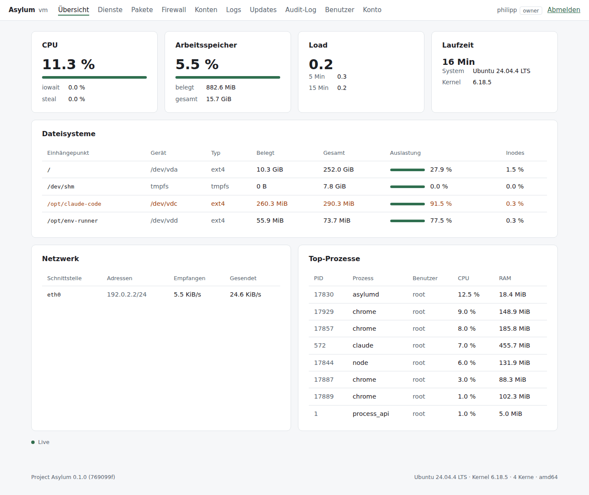
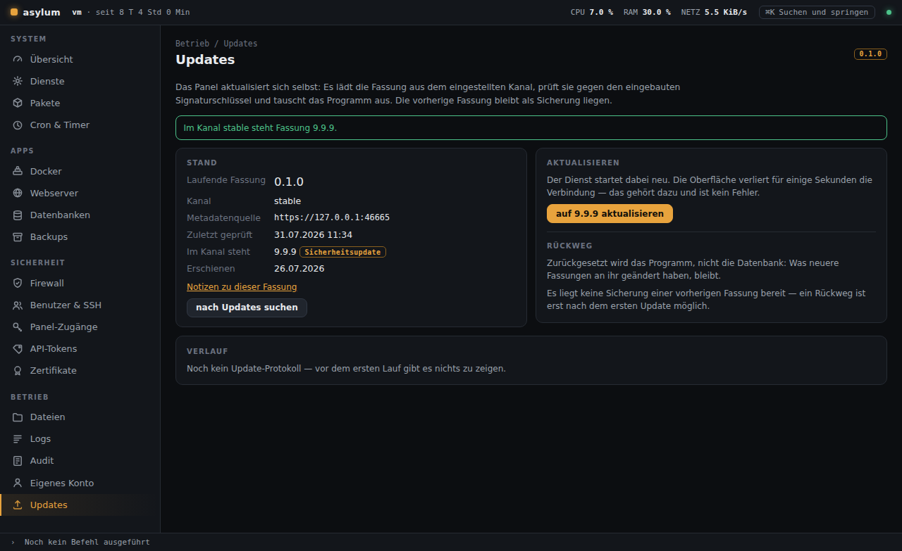
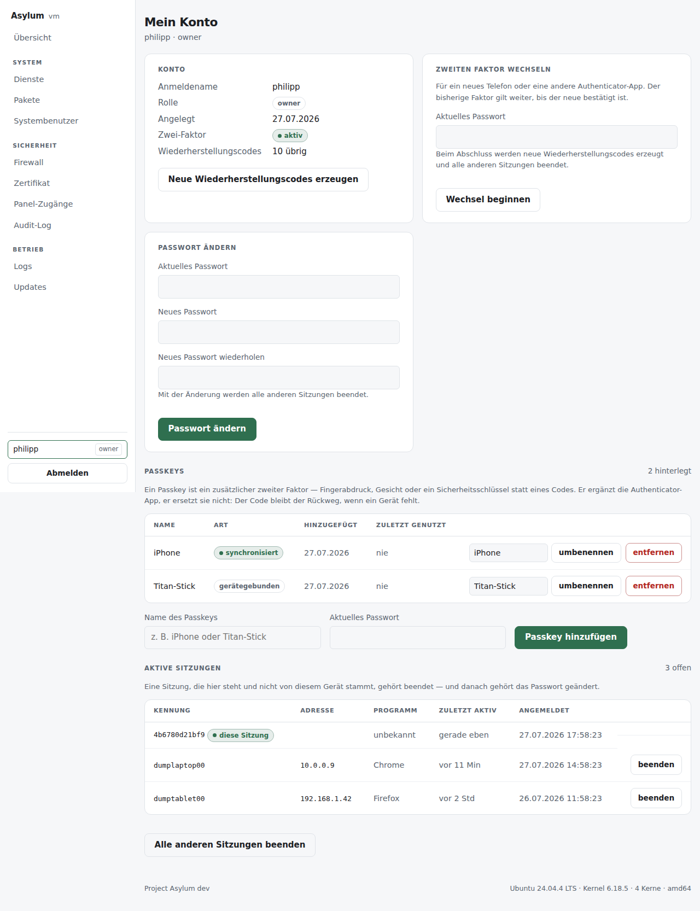
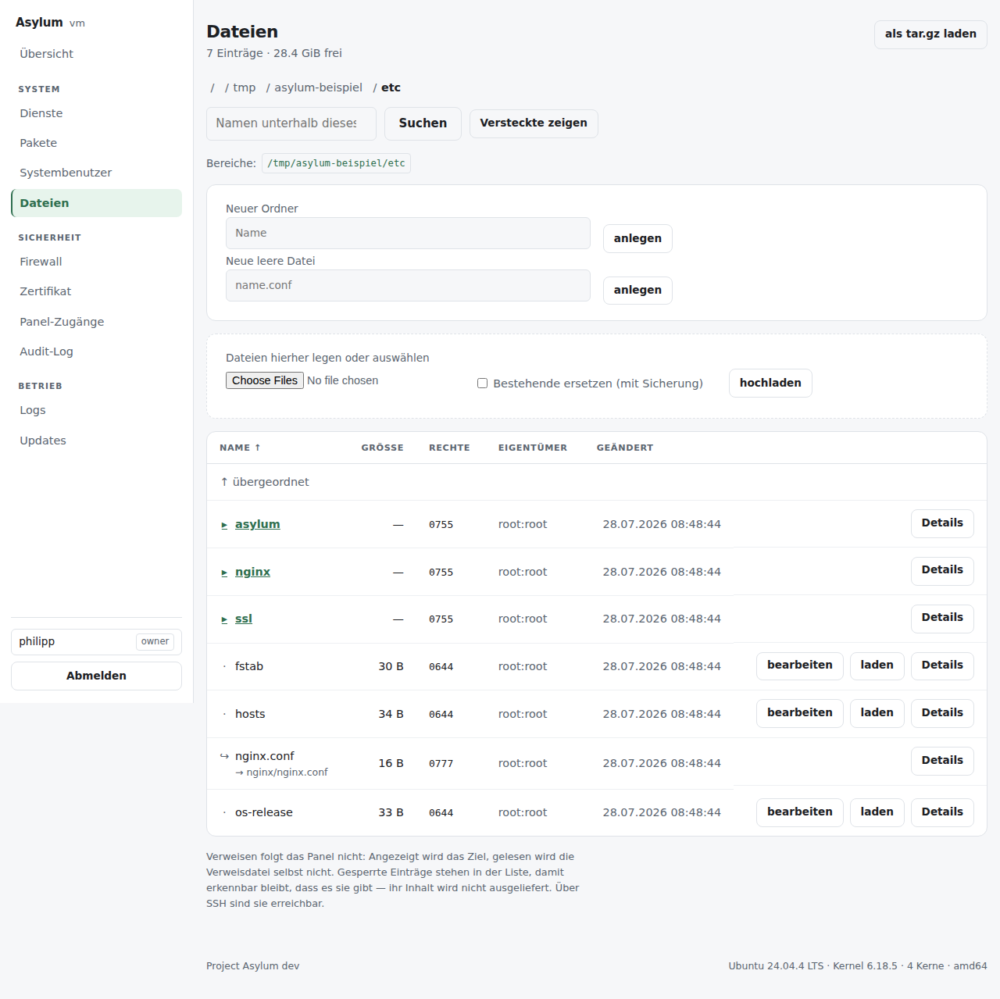
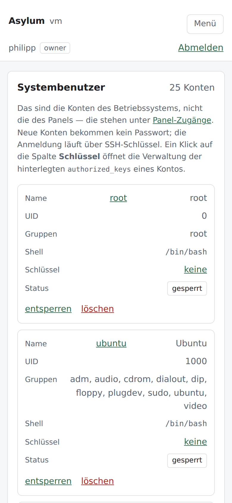

# Project Asylum

Ein Verwaltungs- und Betriebs-Panel für einen einzelnen Linux-Server (primär
Ubuntu & Debian): den Zustand sehen, den Server pflegen, Anwendungen betreiben —
ohne SSH und ohne dass das Panel die Maschine übernimmt.

**A**dministration · **S**ecurity · **Y**AML · **L**ogs · **U**pdates · **M**onitoring

*Asylum* im Sinne von Zuflucht: der Ort, an dem ein Server sicher, überschaubar und
beherrschbar bleibt.

> **Status: 0.5.1 im Kanal `stable`, die Freigabe 1.0 steht aus.**
> Gebaut sind Installation, TLS mit Let's Encrypt, der signierte Release- und
> Selbstupdate-Pfad mit Bereitschaftsprüfung und selbsttätigem Rollback, die
> Anmeldung mit zweitem Faktor und Passkeys, Rollen, Audit-Log sowie die Module
> Übersicht, Dienste, Pakete, Firewall, Systembenutzer & SSH, Dateien, Logs,
> Zertifikate, Cron & Timer, API-Tokens, Panel-Zugänge und das eigene Konto.
>
> Mit **0.4.0** ist die Oberfläche neu gebaut (Svelte über `/api/v1`), mit
> **0.4.1** die alte server-gerenderte Fläche abgebaut. Seither ist das Modul
> **Docker (0.5)** dazugekommen: Compose-Stacks als führendes Objekt samt
> Compose-Prüfer, Container, Bestand, Portübersicht mit Firewall-Abgleich,
> Ereignisstrom und Update-Prüfung. Der Compose-Editor führt seit **0.5.1**
> Felder neben der Datei, in beide Richtungen und ohne Kommentare oder
> Formatierung anzutasten. Die Container-Shell aus dem ursprünglichen
> Zuschnitt ist zurückgestellt. **Webserver & Domains (0.6)** ist begonnen: Der
> Menüpunkt zeigt den Zustand und wer die Ports 80 und 443 hält; verwaltet wird
> nginx, jeder andere Webserver wird erkannt und nicht angefasst. Sites, Prüfer
> und TLS je Domain folgen. Danach **Datenbanken (0.7)**, **Backups (0.8)**;
> 1.0 ist der externe
> Sicherheits-Review, kein neues Feature. Der Plan steht in
> [docs/16-neukonzeption.md](docs/16-neukonzeption.md), die Meilensteine in
> [docs/06-roadmap.md](docs/06-roadmap.md).

## Zielbild

```bash
curl -fsSL --proto '=https' --tlsv1.2 https://repo.cloudsrv24.de/install.sh -o install.sh
sudo bash install.sh
```

Der Installer gibt am Ende einen einmaligen Setup-Link aus. Dort werden
Administrator-Konto und Zwei-Faktor-Anmeldung eingerichtet — es wird bewusst kein
Passwort vergeben, das im Terminal oder in der Shell-History stünde.

Gemessen am aktuellen Stand (0.5.1): 17,7 MB Binary, 20,5 MB RSS im Leerlauf,
39 ms für eine Anmeldung, TLS 1.3 mit selbstsigniertem Zertifikat beim ersten
Start. Das Modul Docker hat davon 584 KiB Binärgröße gekostet und keine einzige
neue Abhängigkeit auf der Go-Seite — es spricht über die Kommandozeile mit
Docker, nicht über eine Bibliothek. Auf der Browserseite kam mit dem
Compose-Formular eine dazu (`yaml`, ISC); sie wird nachgeladen, wenn jemand eine
Compose-Datei öffnet, und liegt sonst still.

Aktualisiert wird über das Panel oder mit `sudo asylum update`: Signatur gegen den
im Binary eingebauten Schlüssel, atomarer Tausch, Neustart, Bereitschaftsprüfung —
und ohne Antwort binnen einer Minute stellt der Server von allein die vorherige
Fassung wieder her.

Keine Runtime-Abhängigkeiten. Kein Docker-Zwang. Kein PHP-Stack. **Kein Node auf
dem Zielserver** — die Oberfläche wird in der Werkstatt gebaut und liegt fertig
im Binary.

## So sieht es aus

Vier Teile, auf jeder Seite dieselben. Oben ein **Statusband** mit Wirt,
Laufzeit, CPU, Speicher, Platte, Last und Netz — jede Anzeige darin ist ein
Link, und ein Live-Kanal schreibt die Zahlen fort. Links eine **Seitenleiste**,
nach System, Apps, Sicherheit und Betrieb gruppiert, mit einem Warnpunkt an den
Zielen, zu denen etwas offen ist: Das Menü verrät damit, wo etwas zu tun ist,
ohne dass man jede Seite besuchen muss. Ein Modul mit mehreren Flächen klappt
seine Unterpunkte auf, solange man darin steht — Docker führt so Stacks,
Container, Ports, Image-Updates und Bestand, jede mit eigener Adresse, und der
Punkt sitzt an der Fläche statt am Modul.
Unten eine **Protokollzeile**, die den zuletzt auf der Maschine ausgeführten
Befehl mit Rückgabewert und Laufzeit zeigt; aufgeklappt die letzten
vierundzwanzig. Dazwischen der Inhalt. Dazu eine **Befehlspalette** auf ⌘K bzw.
Strg+K, die dieselben Ziele durchsucht wie die Leiste.

Der Sinn der Anordnung: Wer auf „Dienste" wechselt, um einen Ausfall zu beheben,
verliert die Kennzahlen nicht aus dem Blick — und beim Seitenwechsel bleibt die
Schale stehen, statt mit jedem Klick neu zu laden. Im Fuß der Leiste ein
Umschalter für hellen und dunklen Modus; ohne Wahl gilt die Systemeinstellung.

Module, die noch nicht gebaut sind — Webserver, Datenbanken, Backups —
stehen bereits im Menü und führen auf eine Seite, die sagt, mit welcher Fassung
sie kommen und was heute an ihrer Stelle geht. Ein Menüpunkt, der stillschweigend
auf der Startseite landet, sieht wie ein Fehler aus.

Die Übersicht ist ein Leitstand: zuoberst ein Urteil in einem Satz — läuft
alles normal, oder brauchen einige Dinge Aufmerksamkeit? Darunter steht nur,
was zu tun ist (ausgefallene Dienste, knapper Plattenplatz, ausstehender
Neustart), jeweils mit dem Weg zur zuständigen Seite. Erst dann folgt die
Telemetrie — CPU, Arbeitsspeicher, Last und Netz je mit dem Verlauf der letzten
Stunden —, dazu Dateisysteme und die größten Prozesse. Die Zahlen aktualisiert
ein Live-Kanal alle zwei Sekunden; die Verläufe sind serverseitig gezeichnet.



Die Update-Seite. Was hier steht, ist auch das Versprechen: geprüfte Signatur,
atomarer Tausch, und ohne Antwort binnen einer Minute stellt der Server von
allein die vorherige Fassung wieder her.



Die Kontoseite mit den eigenen offenen Sitzungen. Ein entwendetes Cookie
hinterlässt sonst keine Spur, die dem Betroffenen auffiele.



Der Dateimanager über das gesamte Dateisystem: browsen, herunterladen,
hochladen, Rechte und Eigentümer setzen, Verzeichnisse als `tar.gz` laden,
Textdateien im Editor bearbeiten. Manche Pfade sind für das Panel tabu — die
Passwort-Hashes des Systems, private Schlüssel, die eigene Datenbank. Sie
erscheinen in der Liste mit Begründung, ihr Inhalt wird nie ausgeliefert, auch
nicht für die Rolle Owner: Wer diese Dateien braucht, hat SSH.
Einzelheiten in [docs/13-dateimanager.md](docs/13-dateimanager.md).



Auf dem Telefon schrumpft die Seitenleiste auf ihre Symbole, das Statusband oben
gibt die Angaben preis, für die kein Platz ist, und aus jeder Tabellenzeile wird
eine Karte mit ihren Beschriftungen — eine Zahl ohne Angabe, wozu sie gehört, ist
keine Auskunft. Ein Server-Panel wird genau dann gebraucht, wenn man nicht am
Schreibtisch sitzt.



Weitere Ansichten: [Dienste](docs/bilder/dienste.png) ·
[Firewall](docs/bilder/firewall.png) · [Audit-Log](docs/bilder/audit.png) ·
[Datei-Editor](docs/bilder/datei-editor.png) ·
[Angaben zu einer Datei](docs/bilder/datei-detail.png)

> Die Bilder entstehen reproduzierbar aus der Anwendung selbst — es sind
> Bildschirmfotos aus dem Browsertest, der die Oberfläche ohnehin bedient:
>
> ```bash
> ASYLUM_LEITSTAND_E2E=1 ASYLUM_E2E_SHOTS=/tmp/shots \
>   ASYLUM_CHROMIUM=… go test ./internal/httpd -run Leitstand
> ```
>
> Die Daten sind gestellt, aber nicht gemalt: Dienste, Pakete, Firewall und
> Systemkonten kommen über den einspeisbaren Runner, die Telemetrie aus einem
> gesetzten Snapshot. Was auf dem Bild steht, hat die Anwendung selbst gerendert.
> Bildschirmfotos von einem echten Server unter systemd stehen noch aus.

## Entwicklung

```bash
make check     # formatieren, vet, Tests mit Race-Detector
make ui        # Oberfläche (Svelte) neu bauen — braucht Node
make build     # Binary nach bin/asylumd
make run       # lokal auf https://127.0.0.1:8443, Daten unter ./.local
make dist      # Release-Artefakte lokal (goreleaser --snapshot)
```

Die benötigte Go-Fassung steht in `go.mod` und gilt als Untergrenze. Sechs
direkte Abhängigkeiten (YAML, SQLite in reinem Go, `x/crypto` für Argon2 und
BLAKE2b, WebAuthn, QR-Code, Terminal-Eingabe), alles Weitere ist
Standardbibliothek. TOTP ist bewusst selbst implementiert — dreißig Zeilen über
`crypto/hmac`, geprüft gegen die Testvektoren aus RFC 6238.

Node braucht nur, wer die Oberfläche ändert: `make ui` baut `web/` nach
`internal/ui/dist/`, und das Ergebnis ist eingecheckt. Auf dem Zielserver läuft
nichts davon — dort liegt ein Binary. Die Regeln dazu stehen in
[CONTRIBUTING.md](CONTRIBUTING.md).

```
cmd/asylumd/          serve | migrate | setup-token | reset-password
                      | update | rollback | cert | passkey | version
web/                  Oberfläche (Svelte, Vite) — gebaut nach internal/ui/dist
internal/config/      Konfiguration laden, Umgebung, Validierung
internal/certs/       selbstsigniertes TLS-Material, Fingerprint
internal/acme/        Let's Encrypt (HTTP-01, DNS-01), Zertifikatshalter
internal/netinfo/     FQDN, Standardroute, Schnittstellen
internal/store/       SQLite, Migrationen, Nutzer, Sitzungen, Audit, Tokens
internal/auth/        Argon2id, TOTP, Tokens, Ratenbegrenzung
internal/passkeys/    WebAuthn-Adapter und Challenge-Speicher
internal/metrics/     /proc-Sampler und Ringpuffer
internal/privops/     einzige Stelle mit Systemzugriff (systemd, apt, ufw, …)
internal/update/      Signaturprüfung, Download, Austausch, Rückweg
internal/httpd/       Router, Middleware, /api/v1, Jobs, SSE
internal/systemd/     sd_notify und Watchdog ohne cgo
internal/ui/          Vorlagen (vor der Anmeldung) und gebaute Assets (embed)
packaging/            install.sh, systemd-Unit, .deb-Skripte
```

### Ersteinrichtung von Hand

```bash
sudo asylum setup-token          # einmaliger Link, 60 Minuten gültig
sudo asylum reset-password NAME  # Rettungsweg, wenn der Zugang verloren ist
sudo asylum passkey list NAME    # hinterlegte Passkeys sehen und entfernen
sudo asylum cert status          # Zertifikat: Herkunft, Namen, Ablauf
sudo asylum update --check       # nachsehen, ob etwas anliegt
sudo asylum rollback             # zurück auf die vorherige Fassung
```

## Leitplanken

| Prinzip | Bedeutung |
|---|---|
| **Ein Binary** | Alles (Backend, Frontend-Assets, Migrationen, CLI) in einer Datei. |
| **Additiv, nicht besitzergreifend** | Das Panel übernimmt den Server nicht. Es schreibt in klar markierte, eigene Config-Blöcke und respektiert manuelle Änderungen. |
| **Nichts verstecken** | Jede Aktion des Panels ist eine nachvollziehbare Systemaktion (systemd, apt, nftables) — kein proprietäres Parallel-Universum. |
| **Sicher per Default** | Argon2id, TOTP-2FA, Passkeys, CSRF, Rate-Limiting, Audit-Log, signierte Releases. |
| **Sparsam auf dem Server, großzügig in der Werkstatt** | Auf dem Zielsystem gelten die Budgets (Binärgröße, Grundlast) und werden gemessen. In der Entwicklung ist eine Frontend-Werkzeugkette zulässig — sie kostet dort nichts. |

Die fünfte Leitplanke hieß bis 0.4 „**Klein bleiben** — Feature-Wünsche gehören
in Module/Plugins, nicht in den Kern". Sie ist umformuliert, weil ein
Ressourcenbudget als Vetorecht gegen Funktionen die falsche Bremse war: Was das
Panel nicht tut, entscheidet die Nicht-Ziel-Liste (kein Mailserver, kein
autoritatives DNS, keine Kundenverwaltung, kein Stack neben apt) — nicht die
Binärgröße. Begründung in
[docs/16-neukonzeption.md](docs/16-neukonzeption.md) §1 und §3.

## Dokumentation

| Dokument | Inhalt |
|---|---|
| [docs/01-sprachwahl.md](docs/01-sprachwahl.md) | Sprachvergleich und Begründung der Empfehlung |
| [docs/02-architektur.md](docs/02-architektur.md) | Prozessmodell, Rechtetrennung, Datenhaltung, Repo-Layout |
| [docs/03-funktionsumfang.md](docs/03-funktionsumfang.md) | Funktionsumfang der Fassungen bis 0.3, bewusste Nicht-Ziele (v0.2/v0.3 überholt, siehe 16) |
| [docs/04-setup.md](docs/04-setup.md) | One-Line-Installer, APT-Repository, Deinstallation |
| [docs/05-updates.md](docs/05-updates.md) | Release-Kanäle, Update-Wege, Migrationen, Rollback |
| [docs/06-roadmap.md](docs/06-roadmap.md) | Meilensteine bis 0.3 und ab 0.4, Qualitätsziele, Risiken, offene Entscheidungen |
| [docs/07-name-lizenz-domain.md](docs/07-name-lizenz-domain.md) | Namensfindung, Lizenzfolgen, Projekt-Domain |
| [docs/08-runbook-domain.md](docs/08-runbook-domain.md) | Runbook: DNS-Verifizierung und GitHub Pages einrichten |
| [docs/09-sicherheitsbetrachtung.md](docs/09-sicherheitsbetrachtung.md) | Anmelde- und Updatepfade: Angreifermodell, Abwägungen, offene Punkte |
| [docs/10-tls-acme.md](docs/10-tls-acme.md) | TLS: selbstsigniert und Let's Encrypt (HTTP-01, DNS-01 über Hook/Cloudflare) |
| [docs/11-passkeys.md](docs/11-passkeys.md) | Passkeys (WebAuthn) als zweiter Faktor: Entwurf, Konfiguration, Rettungsweg |
| [docs/12-zugang-zuruecksetzen.md](docs/12-zugang-zuruecksetzen.md) | Vergessenes Passwort, verlorenes Telefon — und warum es keinen Weg über E-Mail gibt |
| [docs/13-dateimanager.md](docs/13-dateimanager.md) | Dateimanager: Pfadwache, Sperrliste, Upload-Strom, Editor und die CSP |
| [docs/14-bestaetigungen.md](docs/14-bestaetigungen.md) | Rückfragen vor zerstörenden Aktionen: drei Stufen, und warum sie im Handler stehen |
| [docs/15-neuordnung.md](docs/15-neuordnung.md) | Drei Entwürfe für die Neuordnung der Oberfläche (abgelöst; Befund und fünf Grundsätze gelten fort) |
| [docs/16-neukonzeption.md](docs/16-neukonzeption.md) | **Der aktuelle Bauplan:** Scope A+, die Stufen 0.4 bis 1.0, das Gestaltungssystem der neuen Oberfläche |
| [docs/17-docker.md](docs/17-docker.md) | Modul Docker (Stufe 0.5): Zuschnitt, Compose-Prüfer, Bestätigungsstufen, Vergleich mit Arcane, Angriffsdurchgang mit seinen Funden |
| [docs/18-webserver.md](docs/18-webserver.md) | Modul Webserver (Stufe 0.6, im Bau): warum nur nginx verwaltet wird, Sites als Felder, Site-Prüfer, der Port-80-Befund und der mehrfähige Zertifikatshalter |

Dazu im Wurzelverzeichnis: [SECURITY.md](SECURITY.md) (Schwachstellen melden),
[CONTRIBUTING.md](CONTRIBUTING.md), [CHANGELOG.md](CHANGELOG.md) und
[UPGRADING.md](UPGRADING.md).

## Stand der Entscheidungen

| Punkt | Stand |
|---|---|
| Scope | **Verwaltung und Betrieb eines Servers** — Systemthemen plus Container, Webserver, Datenbanken und Backups. Kein Hosting-Panel: kein Mail, kein autoritatives DNS, keine Kundenverwaltung |
| Sprache | **Go**, statisches Single Binary |
| Lizenz | **Apache-2.0** |
| Name | **Project Asylum** — CLI `asylum`, Daemon `asylumd`, Debian-Paket `asylum-panel` (`asylum` ist dort an ein Spiel vergeben) |
| Domain | **`repo.cloudsrv24.de`** auf GitHub Pages — Installer, Update-Metadaten und APT-Repo unter einem Host |

## Mitarbeiten

Fehlerberichte und Beiträge sind willkommen — [CONTRIBUTING.md](CONTRIBUTING.md)
sagt, was ein Pull Request erfüllen muss, damit niemand Arbeit investiert, die an
einer ungeschriebenen Regel scheitert.

**Eine Sicherheitslücke gehört nicht in ein Issue**, sondern in den privaten
Kanal aus [SECURITY.md](SECURITY.md). Dieses Panel läuft mit root-Rechten; ein
offener Bericht ist eine Anleitung für alle, die noch nicht aktualisiert haben.

## Lizenz

[Apache-2.0](LICENSE). Beiträge per DCO (`git commit -s`); ein CLA ist nicht
vorgesehen.
